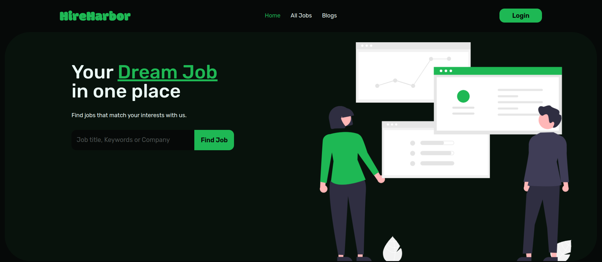

# HireHarbor 

Your Dream Job in One Place.

[Live Website](http://hireharbor-client.web.app) 

[Mirror Link](https://hireharbor.vercel.app)

## Introduction

HireHarbor is a comprehensive job-seeking website designed to provide an intuitive and visually appealing platform for users to discover and apply for various job opportunities. The platform caters to different job types, including On-Site, Remote, Hybrid, and Part-Time positions.

## ✅ Features

- **React**: Utilizes the latest version of React for building user interfaces. React's component-based architecture makes it easy to manage and reuse code, leading to cleaner and more readable codebases.

- **React Router Dom**: Manages routing in our application, making navigation seamless. It allows us to create multiple routes, nested routes, and even lazy load routes to optimize your application.

- **Tanstack Query**: Efficiently manages and updates data from your server. It provides out-of-the-box features like caching, background updates, and stale data handling, reducing the need for global state management.

- **React Helmet Async**: Dynamically manages all of your changes to the document head. It's great for managing changes to your webpage's meta tags, title, and styles.

- **React Hot Toast**: Provides beautiful, customizable toast notifications. It's a lightweight, versatile library for all your notification needs.

- **React Icons**: Offers a wide variety of icons for a more engaging user interface. It includes collections from Font Awesome, Ionicons, Material Design, and more.

- **React Datepicker**: Allows users to easily select dates. It's a simple, customizable, and reusable component that enhances user interaction.

- **Firebase**: Handles user authentication and database management. It's a comprehensive app development platform that provides a real-time database, user authentication, cloud storage, and more.

- **Axios**: Facilitates HTTP requests to your backend. It's a promise-based HTTP client that's easy to use and integrates well with async/await syntax.

- **SweetAlert2**: Creates aesthetically pleasing alerts that are also customizable. It's a beautiful, responsive, customizable, and accessible replacement for JavaScript's popup boxes.

- **Tailwind CSS**: A utility-first CSS framework for rapid UI development. It provides low-level utility classes that let you build completely custom designs without ever leaving your HTML.

- **DaisyUI**: Plugin for Tailwind CSS that adds new utilities and components. It extends Tailwind's functionality, making it even easier to build complex user interfaces.

## License

[GENERAL PUBLIC LICENSE](./LICENSE)
